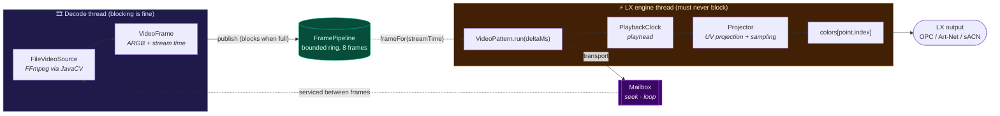

<div align="center">

# 🌒 chromatik-plugins

**Content packages for [Chromatik](https://chromatik.co/), the Java digital lighting workstation.**

Play video on LEDs that aren't a screen.

[](LICENSE)
[](https://adoptium.net/)
[](https://chromatik.co/)
[](#-install)
[](#-roadmap)

[**Download the latest release**](https://github.com/moonbase-labs/chromatik-plugins/releases/latest)

</div>

---

Chromatik renders colour onto a **point cloud**, not a framebuffer. Every LED is an `LXPoint` with a real position in 3D space, which is exactly right for a geodesic dome skinned in LED panels and exactly wrong for anything that assumes a rectangular grid of pixels.

Chromatik ships an `ImagePattern` for still images. It has **no video player**. That's the gap this repo fills.

`VideoPattern` decodes a video on a background thread and projects each frame onto whatever 3D structure you've modelled, sampling a colour per LED through a full UV projection. A flat wall is just the special case where every point shares a `z`.

> [!NOTE]
> **Status: milestone 3 of 5.** Projection works end to end and is confirmed in-app. The full transport (play/pause, loop, speed, seek and scrub) is code complete and passes its headless harness, with the in-app pass on those controls still to come. See the [roadmap](#-roadmap).

## ⬇️ Install

No build tools required. You need [Chromatik](https://chromatik.co/) and nothing else.

1. **Download** the file for your computer from the [latest release](https://github.com/moonbase-labs/chromatik-plugins/releases/latest).

   | Your computer | File |
   |---|---|
   | **Mac** (any, Apple Silicon or Intel) | `chromatik-video-<version>-macos.jar` |
   | **Windows** | `chromatik-video-<version>-windows.jar` |
   | Linux (Intel/AMD) | `chromatik-video-<version>-linux-x86_64.jar` |
   | Linux (ARM, e.g. Raspberry Pi) | `chromatik-video-<version>-linux-arm64.jar` |

2. **Drag it onto the Chromatik window.** Chromatik installs it for you.
3. In the **CONTENT** tab, click **Reload Package Content**.
4. Add a pattern to a channel: category **Laserphile**, pattern **Video**. Click **Browse** and pick a file.

The Mac download carries both Apple Silicon and Intel builds, so there's nothing to check first.

<details>
<summary><b>Prefer to place the file yourself?</b></summary>

Drop the `.jar` in your Chromatik packages folder and restart the app. Chromatik creates the folder the first time it runs.

| | |
|---|---|
| macOS | `~/Chromatik/Packages` |
| Windows | `C:\Users\<you>\Chromatik\Packages` |
| Linux | `~/Chromatik/Packages` |

</details>

Every release is loaded on real hardware of each platform before it ships, so the FFmpeg natives are known to load and decode on all four. Installing and playing end to end inside Chromatik is exercised on macOS, so please [open an issue](https://github.com/moonbase-labs/chromatik-plugins/issues) if another platform misbehaves.

## 📦 What's in here

| Module | Package | Category in Chromatik | What it does |
|---|---|---|---|
| [`packages/chromatik-video`](packages/chromatik-video) | `laserphile.chromatik.video` | **Laserphile → Video** | Decodes a video file and projects it onto the model |

A Maven multi-module build, one module per Chromatik content package. Chromatik discovers packages by scanning `~/Chromatik/Packages/*.jar` for a root `lx.package` file, so one jar is exactly one package and every plugin needs its own module. The root `pom.xml` is the parent: it holds the compiler settings, the `provided` LX dependencies, the `lx.package` filtering, the shade config, and the install profile, so a new module is a ~15-line pom.

The repo is named for what it's growing into. Sibling `laserphile.chromatik.*` packages land alongside this one as they're built, see [`docs/ADDING-A-PLUGIN.md`](docs/ADDING-A-PLUGIN.md).

## ✨ Features

- **Model-agnostic projection.** Works on any `LXModel`: domes, sculptures, strips, matrices. Nothing assumes a grid.
- **Never blocks the engine.** All decode and colour conversion happen off the LX engine thread. `run()` does a lock-free read and a tight per-point loop.
- **Full transport.** Play/pause, loop, 0.1x to 4x speed, and a two-way position slider you can scrub. Looping is gapless and scrubbing coalesces, so a fast drag doesn't queue up a hundred seeks.
- **Full projection control.** Yaw, pitch, roll, translate on three axes, scale, per-axis stretch, and scroll.
- **Four wrap modes.** `CLAMP`, `CLIP`, `TILE`, `MIRROR`, matching the vocabulary of the built-in `ImagePattern`.
- **Transparent background.** `CLEAR` lets lower LX layers show through where the image doesn't reach.
- **Bilinear sampling.** Cuts the shimmer you get when a sparse point cloud samples a small texture.
- **Native file chooser.** A `Browse` button opens the real OS open dialog, no typing paths. It opens on the current video's folder, or on the folder you browsed to last, so picking a second clip is one click away. Files under `~/Chromatik` are stored as relative paths so a shared project still finds them.
- **Zero custom UI.** A plain `LXPattern`, so Chromatik auto-generates the control panel and the whole thing runs on the **FREE licence tier**.

## 🔧 Requirements

Only for building from source. Installing a release needs none of this.

| | Version | Notes |
|---|---|---|
| **JDK** | 21 | [Temurin](https://adoptium.net/) recommended, to match Chromatik's own runtime |
| **Maven** | 3.9+ | |
| **Chromatik** | 1.2.1 | Pinned via `lx.version` in the root `pom.xml` |

<details>
<summary><b>Setting up JDK 21 on macOS</b></summary>

```bash
brew install --cask temurin@21
brew install maven

echo 'export JAVA_HOME="$(/usr/libexec/java_home -v 21)"' >> ~/.zshrc
echo 'export PATH="$JAVA_HOME/bin:$PATH"' >> ~/.zshrc
```

Open a new shell, then confirm all three agree:

```bash
java -version    # 21.x
javac -version   # 21.x
mvn -version     # should report the Temurin 21 JAVA_HOME
```

`brew install openjdk@21` works too and skips the admin password prompt, but it's keg-only, so `JAVA_HOME` has to point at `/opt/homebrew/opt/openjdk@21/libexec/openjdk.jdk/Contents/Home` by hand.

</details>

## 🚀 Build from source

```bash
git clone https://github.com/moonbase-labs/chromatik-plugins.git
cd chromatik-plugins

# Build for this Mac, into packages/*/target/
mvn package

# Build and drop into ~/Chromatik/Packages
mvn -Pinstall install
```

Then:

1. **Launch Chromatik.** The log should show `Loading package content from: …` followed by a `Package:Laserphile Video` line.
2. **Add the pattern** to a channel: category **Laserphile**, pattern **Video**.
3. **Pick a video.** Click `Browse`, or type a path into the `File` box. Either way the decode thread restarts on the spot.

A plain `mvn package` builds the macOS jar, which is the one this repo is developed against. Pass a profile to build for somewhere else:

```bash
mvn package -Pdist-windows
mvn package -Pdist-linux-x86_64
mvn package -Pdist-linux-arm64
```

Each produces one jar named for its platform. There's no cross-compilation involved, the FFmpeg native is an ordinary Maven dependency, so any machine can build any target.

Check a jar before shipping it. This loads its bundled natives and decodes ten frames, and is the same gate [CI](.github/workflows/ci.yml) runs on real hardware of every platform:

```bash
java -cp packages/chromatik-video/target/chromatik-video-*-macos.jar ci/NativeLoadCheck.java
```

> [!TIP]
> Relative paths resolve under `~/Chromatik/`, absolute paths are used verbatim. `Browse` already stores anything under `~/Chromatik` as a relative path, which keeps a `.lxp` project working when someone else opens it.

> [!IMPORTANT]
> On Chromatik's FREE tier, Art-Net, sACN, DDP, and OPC drive real fixtures for models up to **1,000 points**, with rendering capped separately at 20,000. Develop and test against the 3D preview and you stay well inside both. Go over the output cap and Chromatik holds output back for as long as the model stays over, logging `Network output is disabled due to license restrictions.` Rigs above 1,000 points want a paid tier or an external output server.

## 🎛️ Parameters

Chromatik generates the panel from these automatically.

| Parameter | Type | Default | Range | Description |
|---|---|---|---|---|
| `File` | String | empty | | Absolute path, or relative to `~/Chromatik` |
| `Browse` | Trigger | | | Pick a video with the native file chooser |
| `Reload` | Trigger | | | Re-open the file |
| `Play` | Boolean | `on` | | Run the playhead |
| `Loop` | Boolean | `on` | | Start again on reaching the end |
| `Speed` | Compound | `1` | 0.1 to 4 | Playback rate. Affects the playhead only, never the decode rate |
| `Position` | Compound | `0` | 0 to 1 | Playhead. Follows playback, and seeks when you drag it |
| `Restart` | Trigger | | | Jump back to the start and play |
| `Yaw` | Compound | `0` | -180 to 180 | Rotation about the vertical axis |
| `Pitch` | Compound | `0` | -180 to 180 | Rotation about the horizontal axis |
| `Roll` | Compound | `0` | -180 to 180 | Rotation about the view axis |
| `TransX` `TransY` `TransZ` | Compound | `0` | -1 to 1 | Shift the image on each axis |
| `Scale` | Compound | `1` | 0.1 to 10 | Zoom, larger values zoom in |
| `StretchX` `StretchY` | Compound | `1` | 0.1 to 10 | Per-axis stretch on top of `Scale` |
| `ScrollX` `ScrollY` | Compound | `0` | -1 to 1 | UV offset, animate for a pan |
| `Wrap` | Enum | `CLAMP` | `CLAMP` `CLIP` `TILE` `MIRROR` | Sampling behaviour outside the image |
| `Background` | Enum | `BLACK` | `BLACK` `CLEAR` | Colour for points rejected by `CLIP` |
| `Interp` | Enum | `BILINEAR` | `NEAREST` `BILINEAR` | `NEAREST` is blocky, `BILINEAR` is smoother |
| `Level` | Compound | `1` | 0 to 1 | Master brightness |

Every `Compound` parameter is modulatable, so any of them can be driven by an LFO, an envelope, or MIDI.

### Knob order on a control surface

A MIDI surface binds its eight device knobs to the first eight of the pattern's remote controls, and an APC40 has no way to page past the eighth. So those eight are all continuous, in this order:

| Knob | 1 | 2 | 3 | 4 | 5 | 6 | 7 | 8 |
|---|---|---|---|---|---|---|---|---|
| | `Level` | `Speed` | `Scale` | `ScrollX` | `ScrollY` | `Yaw` | `Pitch` | `Roll` |

`Position`, the stretches, the translates and the enums follow, and `Play`, `Loop` and `Restart` sit at the end. The panel order in the table above is set separately and is unchanged by this.

## 🧠 How it works

Two threads, one hand-off, no locks on the hot path.



The decode thread owns the FFmpeg grabber and pushes finished frames into a small bounded ring. The engine picks the newest frame that's due at the current playhead and leaves the rest. A full ring is the only brake on decoding, which makes back-pressure fall out for free: pausing or playing below 1x stalls the decode thread on the ring, and playing above 1x drains it so decode runs flat out to keep up. If decode still can't keep up, the engine re-projects the newest frame it has and the playhead carries on, so media time stays honest and frames are dropped instead.

Control flows the other way through a mailbox the decode thread reads between frames. Seeks coalesce to the newest target and carry a generation number, so a fast scrub never flashes footage from a position you've already dragged past. Looping happens entirely on the decode thread, so the seam is gapless: it stamps every frame with a timeline that keeps climbing straight through the loop point, which is the same timeline the playhead runs on.

Frames are currently decoded at their native resolution. Downscaling them on the decode thread is [M5](#-roadmap): LED counts are in the hundreds or thousands, so sampling a few thousand points out of a 4K frame is wasted work, and a small hot buffer is both faster and kinder to the cache.

<details>
<summary><b>The projection maths</b></summary>

Per point, in normalised model coordinates so nothing depends on the model's real-world size:

```
c = (xn-0.5, yn-0.5, zn-0.5) - (translateX, translateY, translateZ)
r = transpose(R) * c            // inverse-rotate into the texture plane
u = r.x * invScaleX + 0.5 + scrollX
v = r.y * invScaleY + 0.5 + scrollY
                                // r.z is dropped: the projection is orthographic
```

`R = Rz(roll) * Ry(yaw) * Rx(pitch)`, built once per frame in `ProjectionParams.recompute()` along with the reciprocal scales, so the per-point loop does no trig and no division.

`(u, v)` then goes through the wrap mode, and the result is sampled nearest or bilinear. Points that `CLIP` rejects take the background colour.

This is re-implemented from the documented behaviour of Chromatik's `ImagePattern`, not copied from it. Chromatik is proprietary; the algorithms aren't.

</details>

<details>
<summary><b>Source layout</b></summary>

All under `packages/chromatik-video/src/main/java/laserphile/chromatik/video/`.

| File | Thread | Role |
|---|---|---|
| `VideoPattern.java` | engine | Orchestrator. Owns the parameters, drives the clock, pipeline, and projector. The only public, auto-discovered class. |
| `FrameSource.java` | decode | Interface. The seam that lets screen capture drop in later without touching projection. |
| `FileVideoSource.java` | decode | Wraps `FFmpegFrameGrabber`. Video track only, so the audio is never decoded or seeked. |
| `FramePipeline.java` | both | Owns the decode thread, the frame ring, and the control mailbox. Idempotent start/stop with a bounded join. |
| `PlaybackClock.java` | engine | The playhead. Pure state: play, speed, and the pending seek target, no I/O. |
| `VideoFrame.java` | both | A decoded frame plus its place on the timeline. |
| `Projector.java` | engine | The per-point UV projection and sampling loop. |
| `ProjectionParams.java` | engine | Per-frame snapshot of the controls, with the rotation matrix precomputed. |

</details>

## 🗺️ Roadmap

- [x] **M0** Decode spike. Benchmarked JavaCV/FFmpeg on real footage: ~4,450 fps at 384×216, against the ~60 needed.
- [x] **M1** Skeleton. Package loads in-app, decode thread runs, engine stays non-blocking.
- [x] **M2** Projection MVP. Full UV projection, all four wrap modes, both background modes, nearest and bilinear.
- [x] **M3** Transport. Playback clock, play/pause, loop, speed, seek and scrub, ring buffer with back-pressure and a real drop policy.
- [ ] **M4** Screen capture. A live `ScreenCaptureSource` behind the existing `FrameSource` seam.
- [ ] **M5** Polish. BT.709 colour-space correction, gamma, working-resolution downscale, frame pooling, a slimmer uber-jar. (Per-OS build profiles landed early, with the release pipeline.)

Design decisions, open questions, and per-milestone detail live in [`docs/`](docs/): [`PLAN.md`](docs/PLAN.md) is the source of truth, [`PROGRESS.md`](docs/PROGRESS.md) tracks state and carries the decisions log.

## 🛠️ Development

```bash
mvn package                                  # build every plugin
mvn -Pinstall install                        # build, then copy into ~/Chromatik/Packages

mvn -pl :chromatik-video package             # just one plugin
mvn -Pinstall install -pl :chromatik-video   # build and install just one
```

Chromatik reloads a rebuilt package from the **CONTENT** tab: **Reload Package Content**, or leave **Auto-Reload Packages** on.

Adding a plugin is four files and one line in the root pom: [`docs/ADDING-A-PLUGIN.md`](docs/ADDING-A-PLUGIN.md).

### Releasing

Tagging publishes. [CI](.github/workflows/ci.yml) builds all four platform jars, loads each one on real hardware of its platform, then attaches them with checksums.

```bash
git tag v0.1.0 && git push origin v0.1.0
```

Versions are [semver](https://semver.org/): `vMAJOR.MINOR.PATCH`, optionally with a `-prerelease` suffix. A tag that isn't fails the build before anything is published, and a `-prerelease` tag (`v0.2.0-rc.1`) is marked as such on GitHub so it stays out of "latest release". Build metadata (`+`) is rejected: semver ignores it for precedence and it mangles download URLs.

The tag is the only place a release version lives. The pom stays on `-SNAPSHOT` naming the release it's heading for, and CI overwrites it at build time so the jar reports a real version through `lx.package`.

What counts as breaking, for a Chromatik package, is compatibility with saved `.lxp` projects, since those store the pattern's class name and its parameter paths:

| | Means |
|---|---|
| **MAJOR** | A saved project won't reload cleanly: a parameter renamed or removed, the pattern class renamed, or `mediaDir` changed. |
| **MINOR** | New parameters, new patterns, a newly supported platform. Existing projects unaffected. |
| **PATCH** | Fixes and performance work with no change to the parameter surface. |

While MAJOR is `0` this is pre-1.0, so a MINOR bump is allowed to break things. Reaching 1.0 is the promise not to.

A few things worth knowing before you touch the code:

> [!CAUTION]
> Any enum used with an `EnumParameter` **must be `public`, and so must its enclosing class.** LX reflects on the enum's `values()` from another package. A package-private enum compiles cleanly and then throws `IllegalAccessException` the moment the pattern is instantiated. That's why `ProjectionParams` and its nested enums are public.

- **`lx.version` is pinned deliberately.** LX and GLX are `provided` scope: Chromatik supplies them at runtime through its `LXClassLoader`. If the pinned version drifts from the installed app, the API mismatch shows up at runtime, not at compile time.
- **Never relocate the `org.bytedeco` packages in the shade config.** JavaCPP looks its native libraries up as classpath resources by literal path, so relocating those packages breaks native loading in a way that's genuinely unpleasant to debug.
- **The first `FFmpegFrameGrabber.start()` per JVM costs about 6 seconds** while JavaCPP extracts natives to `~/.javacpp/cache`. Every subsequent start is ~2 ms. It happens on the decode thread, so the UI stays responsive.
- **`swscale` logs `no accelerated yuv420p->bgr24`** on startup. Benign, but it's the flag for the BT.709 colour-space work parked in M5.

## 📄 Licence

This project is MIT licensed. See [LICENSE](LICENSE).

> [!IMPORTANT]
> **The built jar is not purely MIT.** It bundles FFmpeg via [JavaCV](https://github.com/bytedeco/javacv) / [Bytedeco](https://github.com/bytedeco/javacpp-presets), and the default Bytedeco FFmpeg build is **LGPL 2.1+**. The MIT licence covers the source in this repository. If you redistribute a built jar, you're also redistributing LGPL binaries and take on the LGPL's obligations, notably keeping the FFmpeg portions LGPL and letting recipients replace them.
>
> The `-gpl` classifier variants of the FFmpeg artifact are full GPL and would be far more restrictive. This project deliberately uses the default LGPL build, and you should keep it that way unless you've thought hard about the consequences.

## 🙏 Credits

Built for **[TeleCortex](https://github.com/Laserphile/TeleCortex)**, a 2V icosahedron geodesic dome skinned in hand-made coreflute LED panels: roughly 5,725 individually addressable APA102/SK9822 LEDs driven by five Teensy microcontrollers, built to be shown at [Blazing Swan](https://blazingswan.com.au/) in Western Australia.

The dome has played video before, on the bespoke Python and JavaScript stacks that preceded this. `VideoPattern` generalises that trick onto a platform with a real mixer, a real pattern engine, and a real UI.

- **[Chromatik](https://chromatik.co/)** and the open-source **[LX](https://github.com/heronarts/LX)** engine, by Mark Slee / Heron Arts.
- **[Laserphile](https://blog.laserphile.com/)** (Derwent) for TeleCortex and the LED-control lineage this builds on.
- **[Moonbase Labs](https://github.com/moonbase-labs)**, a Perth collective creating experiences with light, sound, and technology.

<div align="center">
<sub>Made in Perth 🌏 for things that glow in the desert.</sub>
</div>
